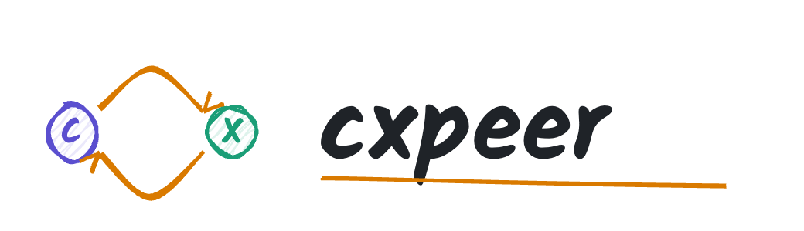
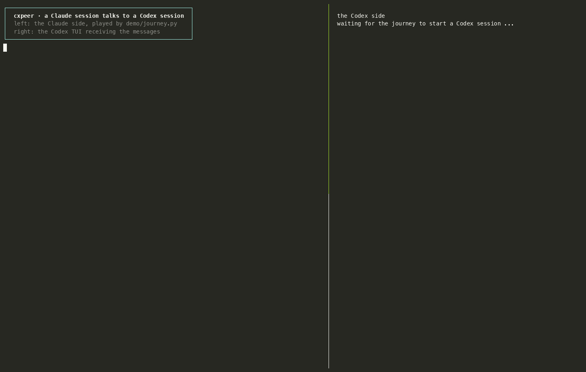
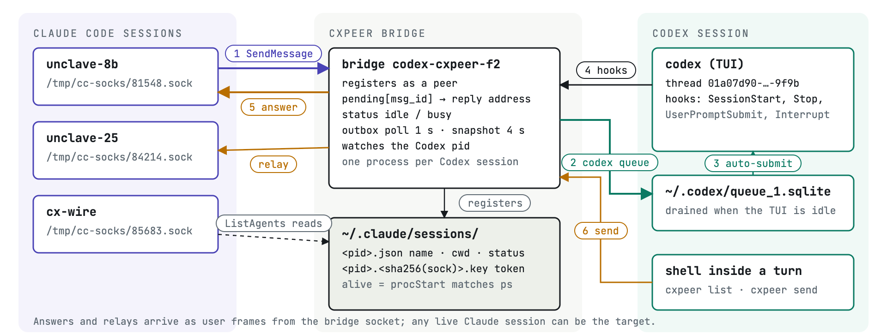
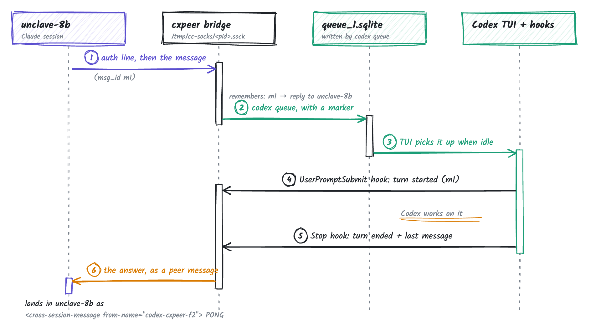
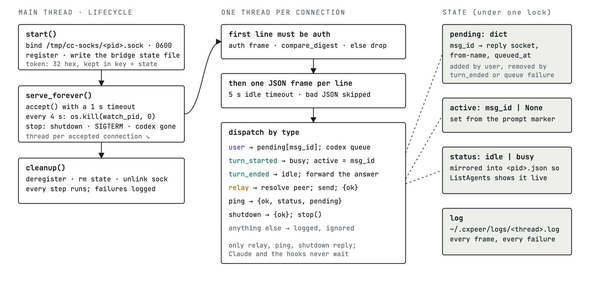
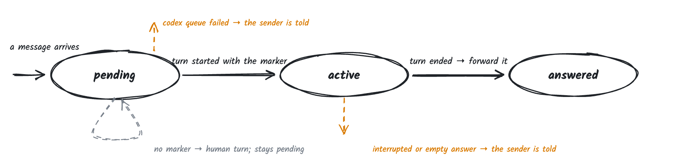
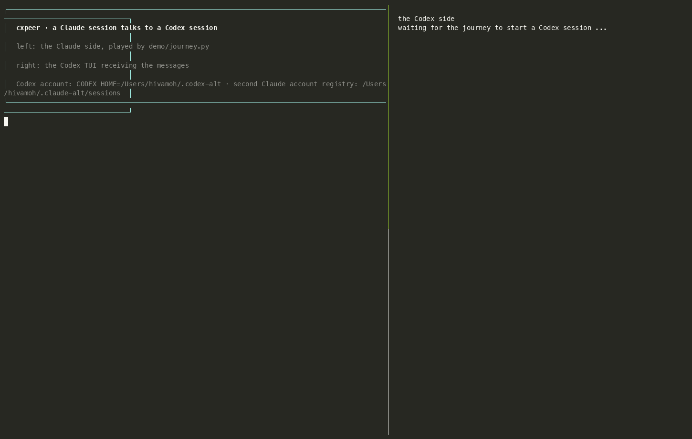

<p align="center">
  <picture>
    <source media="(prefers-color-scheme: dark)" srcset="docs/images/cxpeer-logo-dark.png">
    
  </picture>
</p>

<h3 align="center">
Codex sessions as peers in Claude Code's cross-session messaging
</h3>

<p align="center">
| <a href="#getting-started"><b>Getting started</b></a> | <a href="#how-it-works"><b>How it works</b></a> | <a href="docs/user-journey.md"><b>User journey</b></a> | <a href="demo/README.md"><b>Demo</b></a> | <a href="docs/superpowers/specs/2026-09-07-cxpeer-design.md"><b>Design notes</b></a> | <a href="https://github.com/HivaMohammadzadeh1/cxpeer/issues"><b>Issues</b></a> |
</p>

---

<p align="center"></p>

<p align="center">A real run, recorded with asciinema; Codex's thinking time is compressed to a few seconds. Left: the Claude side, played by <code>demo/journey.py</code>. Right: the Codex TUI receiving the messages. <b><a href="docs/images/journey.mp4">Watch the MP4</a></b> (title card, step captions, 47 s) · <a href="docs/user-journey.md">transcript</a> · <a href="docs/journey.cast">cast</a></p>

## Latest news

- [2026-09-10] v0.4.0: context budget. A peer message costs Codex about 17 tokens of framing instead of 87, long answers are capped with the full text one `cxpeer read` away, and both skills are a third of their old size. Numbers in [Context budget](#context-budget). Run `cxpeer install` again to get the new Codex skill.
- [2026-09-07] v0.3.0: several Claude accounts (every `~/.claude*` registry) and several Codex accounts (`--codex-home`) on one machine, with a [recorded run](docs/user-journey-accounts.md).
- [2026-09-07] A recorded [user journey](docs/user-journey.md): install check, spawn a Codex peer, give it a task, have it message back from inside its sandbox. 41 seconds end to end.
- [2026-09-07] v0.2.0: `cxpeer doctor`, `cxpeer spawn --wait` with peer names, idle notices (`notify_when_idle`), a self-healing bridge, Linux CI, and a runnable [demo](demo/README.md).
- [2026-09-07] v0.1.0: first working version. A Claude Code session messaged a live Codex TUI and got the answer back in 8 seconds.

## About

cxpeer makes a running Codex CLI session show up as a peer in Claude Code's
cross-session messaging. A Claude session can `SendMessage` it, and Codex's answer comes
back when the turn ends. Codex can message Claude sessions too.

There is no daemon. One small bridge process per Codex session writes the three files
Claude Code uses to find peers (a record, a key, a Unix socket), pushes inbound
messages into Codex with `codex queue`, and reads turn boundaries from Codex's hooks.

cxpeer is small:

- About 2,000 lines of Python, standard library only
- One process per Codex session, no background service
- The Claude side needs nothing installed; Codex peers appear in `ListAgents` like any other session
- 154 tests, run on macOS and Ubuntu in CI

cxpeer does:

- Claude → Codex: `SendMessage` lands in the Codex TUI in about three seconds
- Codex → Claude: the final message of the turn is forwarded to whoever asked
- `notify_when_idle` subscriptions, answered when the Codex turn ends or the session exits
- `cxpeer send` and `cxpeer list` from inside Codex's sandbox, through a file outbox, since the sandbox blocks sockets and `ps`
- `cxpeer spawn codex --peer-name NAME --prompt "..." --wait`: start a Codex peer from a Claude session and know when it is ready
- `cxpeer doctor`: ten checks plus a self-test that starts a bridge and messages it

## Getting started

Requirements: macOS, Python 3.11+, Codex CLI 0.153+, Claude Code 2.1.263+. `cxpeer spawn` needs tmux.

```sh
uv tool install git+https://github.com/HivaMohammadzadeh1/cxpeer   # or pipx
cxpeer install
cxpeer doctor
```

`cxpeer install` adds five hook entries to `~/.codex/hooks.json` and a small skill to
`~/.codex/skills/cxpeer/SKILL.md`. It leaves hooks it did not write alone; `--dry-run`
shows what it would write. The next time Codex starts it asks whether to trust the new
hooks. Pick "Trust all and continue", otherwise no bridge is created. Run `cxpeer install`
again after upgrading.

Then, from a Claude Code session:

```sh
cxpeer spawn codex --cwd ~/proj --peer-name codex-tests --prompt "run the test suite and report" --wait
```

`ListAgents` now shows `codex-tests`. `SendMessage` to it works like any other session,
and the final message of each Codex turn comes back as a cross-session message. Add
`notify_when_idle` to the SendMessage to also get an idle notice.

You can also just run `codex` yourself. The bridge appears when you submit the first
prompt (Codex creates the session lazily) and the peer is named `codex-<dir>-<xx>`.

There is a Claude Code plugin with a skill that explains this to Claude:

```sh
claude plugin marketplace add HivaMohammadzadeh1/cxpeer
claude plugin install cxpeer@cxpeer
```

From a checkout: `uv tool install --editable .` or `pipx install -e .`.

## How it works





1. The SessionStart hook starts a bridge and tells it the Codex pid to watch. A
   per-thread lock keeps it to one bridge per session.
2. A Claude session sends a message. It lands on the bridge's socket. The bridge runs
   `codex queue`, and the TUI picks the text up when idle.
3. The queued text ends with a `[cxpeer msg_id=...]` marker. The UserPromptSubmit hook
   reports the marker back, so the bridge knows which request this turn belongs to.
   When the turn ends, the Stop hook hands over Codex's last message and the bridge
   forwards it to whoever asked. A prompt typed by a human has no marker, so it is never
   forwarded. An interrupted turn tells the sender that. A request that never gets a
   turn expires after 15 minutes, with a note.
4. `cxpeer send` from inside Codex asks the bridge to relay to a peer.
5. Idle subscriptions get one notice once every queued request has been answered, or
   an "exited" notice if the session goes away first.
6. SessionEnd tells the bridge to deregister. If Codex dies without the hook, the bridge
   sees the pid go away and cleans up. If the bridge dies first, the next hook event
   starts a new one.

Measured on 2026-09-07: a SendMessage answered in 8 s end to end, most of it Codex
thinking; a `cxpeer send` from inside Codex arrived in Claude 10 s after the request;
the demo below runs in about 10 s.

### Inside the bridge

About 400 lines in `cxpeer/bridge.py`. The main thread binds the socket, registers, and
accepts connections. Each connection gets a thread that checks the auth line and
dispatches frames by type. State is one dict of pending requests, an "active" pointer,
the idle/busy status, and the idle subscriptions, behind a lock.





The on-disk contract, as of Claude Code 2.1.263:

```text
~/.claude/sessions/<pid>.json                       record: name, cwd, status, socket path, procStart
~/.claude/sessions/<pid>.<sha256(socket path)>.key  {"peerToken": <32 hex>, "procStart": ..., "pidDomain": "darwin"}  (0600)
/tmp/cc-socks/<pid>.sock                            the socket (0600)
```

Two JSON lines per message. First the receiver's token, then the message. `from` is
where replies go.

```json
{"type":"auth","token":"<receiver's peerToken>"}
{"msgV":1,"msg_id":"<uuid4>","type":"user","priority":"next","from":"uds:/tmp/cc-socks/<sender pid>.sock",
 "message":{"role":"user","content":"<cross-session-message from=\"uds:...\" from-name=\"codex-tests\" from-mode=\"prompting\">\nPONG\n</cross-session-message>"}}
```

Idle subscriptions are `{"type":"control","action":"notify_when_idle",...}` frames and
the bridge answers with `{"type":"control","action":"peer_idle_notice","state":"idle",...}`.

### The Codex sandbox

Codex runs shell commands in a sandbox. Inside it, `ps` cannot execute and Unix sockets
cannot be opened, but reading the home directory works and writes to `/tmp`, `$TMPDIR`,
and the cwd are allowed. So `cxpeer send` and `cxpeer list` inside Codex do not touch
the socket:

- `send` writes `{id, to, text}` to `/tmp/cxpeer-<uid>/<thread>/`. The bridge polls that
  directory every second, relays, and writes `<id>.result.json` back.
- `list` reads a peers snapshot the bridge rewrites every four seconds. Older than 15 s
  means no bridge.

The client switches to files on its own when a socket connect raises PermissionError or
`ps` fails. Outside the sandbox the same commands use the socket.

### Context budget

Every message a session receives is paid for in tokens, so the bridge keeps its own framing small.

- **One line of framing, not an XML envelope.** Claude wraps peer messages in a `<cross-session-message>` block with the sender's socket path. The bridge rewrites it to `[peer message from NAME · id XXXXXXXX]` and a matching marker on the last line. The message ids are shortened to 8 characters; the bridge pairs the hook's marker by prefix.
- **The how-it-works hint goes out once.** The first message in a Codex session ends with one sentence about auto-forwarding and `cxpeer send`. Later messages carry the marker only; the installed skill has the rest.
- **Long answers are capped.** A forwarded reply longer than 4000 characters (`CXPEER_REPLY_MAX_CHARS`) is cut, the full text is written to `~/.cxpeer/replies/<thread>/<id>.md`, and the note at the end says `full text: cxpeer read <id>`. Read it only when you need it.
- **Idle notices do not repeat the answer.** When the answer was already forwarded, the notice's detail is `answered NAME (N chars)`.
- **Both skills tell the model to send paths, not contents.** The two sessions share a machine, so a file path costs a dozen tokens where its contents would cost thousands.

Measured on a 30-character message, per message, characters of framing Codex reads:

| | v0.3.0 | v0.4.0 first message | v0.4.0 later messages |
| --- | --- | --- | --- |
| Framing | 351 chars (~87 tokens) | 204 chars (~51 tokens) | 71 chars (~17 tokens) |
| Codex skill (loaded once) | 1445 bytes | 691 bytes | |
| Claude skill (loaded once) | 2319 bytes | 869 bytes | |

`cxpeer status` prints the characters each bridge has queued into Codex and forwarded out, with a rough token count, so you can see what a conversation cost.

## Multiple accounts

Two Claude Code accounts on one machine each have their own config home
(`CLAUDE_CONFIG_DIR`), and with it their own peer registry. The bridge registers a Codex
peer into every registry it knows about: `~/.claude/sessions` plus any
`~/.claude-*/sessions` or `~/.claude_*/sessions` that exists. Set
`CXPEER_CLAUDE_SESSIONS_DIRS` (colon-separated) to name the registries explicitly;
setting the singular `CXPEER_CLAUDE_SESSIONS_DIR` means that one registry only, no
discovery. `cxpeer list`, `cxpeer send`, and `cxpeer doctor` read all of them, so both
accounts see and can message the same Codex session.

Two Codex accounts each have their own `CODEX_HOME`. Install the hooks into each and
start sessions with the home you want:

```sh
cxpeer install --codex-home ~/.codex-work
cxpeer doctor  --codex-home ~/.codex-work
cxpeer spawn codex --codex-home ~/.codex-work --peer-name codex-work --prompt "..." --wait
```

Hooks and the bridge inherit the Codex process environment, so each session's bridge
queues into the right account's Codex. A plain `codex` started with `CODEX_HOME` set in
the shell works the same way.

<p align="center"></p>

<p align="center">The journey with a second Codex home and a second Claude registry. <b><a href="docs/images/journey-accounts.mp4">Watch the MP4</a></b> · <a href="docs/user-journey-accounts.md">transcript</a> · <a href="docs/journey-accounts.cast">cast</a></p>

## Commands

- `cxpeer list`: live peers, one per line.
- `cxpeer send --to NAME TEXT`: message a peer. `TEXT` can be `-` for stdin.
- `cxpeer status`: every bridge, whether it answers, requests waiting for a turn, characters in and out.
- `cxpeer read ID`: the full text of a reply the bridge forwarded truncated. The 8-character id from the note is enough.
- `cxpeer doctor`: the checks described above.
- `cxpeer install [--dry-run]`: install or update the hooks and skill.
- `cxpeer spawn codex|claude [--cwd DIR] [--name N] [--peer-name N] [--prompt TEXT] [--wait] [--timeout S] [-- ARGS...]`
- `cxpeer bridge --thread ID --cwd DIR [--name N] [--watch-pid PID]`: run a bridge (the hook does this).
- `cxpeer hook EVENT`: what the hooks call. Never exits non-zero.

## Configuration

All paths can be overridden, which is how the tests stay away from real state.

| Variable | Default |
| --- | --- |
| `CXPEER_CLAUDE_SESSIONS_DIR` | `~/.claude/sessions` |
| `CXPEER_SOCK_DIR` | `/tmp/cc-socks` |
| `CXPEER_HOME` | `~/.cxpeer` (bridge records, snapshots, logs) |
| `CXPEER_OUTBOX_ROOT` | `/tmp/cxpeer-<uid>` |
| `CXPEER_CODEX_BIN` | `codex` |
| `CXPEER_CODEX_HOME` | `~/.codex` |
| `CXPEER_TMUX_BIN` | `tmux` |
| `CXPEER_PENDING_TTL_SECONDS` | `900` |
| `CXPEER_REPLY_MAX_CHARS` | `4000` (longer replies are cut; `cxpeer read` has the rest) |

Logs go to `~/.cxpeer/logs/hooks.log` and `~/.cxpeer/logs/<thread>.log`.

## Contributing

```sh
uv venv .venv --python 3.13 && uv pip install -e ".[dev]" --python .venv/bin/python
.venv/bin/python -m pytest tests -q
```

The fixtures in `tests/conftest.py` point every path at a temp dir and swap `codex` for
a script that records its arguments, so nothing touches your real setup. The bridge
tests run it as a subprocess and talk to it over its socket. `scripts/e2e.sh [DIR]`
starts a real Codex in tmux and prints the peer name; `scripts/e2e.sh down` kills it.
`python demo/demo.py` runs the whole loop against a real Codex without a Claude session, and
`python demo/journey.py --record docs/user-journey.md` runs the narrated version,
`scripts/record-journey.sh` records it side by side with the Codex TUI (asciinema), and
`scripts/make-demo-video.sh` turns a cast into the README GIF and a captioned MP4
(`scripts/compress-cast.py` shortens the waits).

Issues and pull requests are welcome. Keep changes small and add a test for the failure
path, not only the happy one.

## Caveats

- This sits on an undocumented Claude Code internal (`peerProtocol` 1). An update can
  break it. The tests pin the current contract, so at least it breaks loudly.
- Only used on macOS so far. Tests pass on Linux in CI but nobody has run a Linux peer
  by hand. No Windows.
- Messages are plain text between processes running as you. Outbox files in
  `/tmp/cxpeer-<uid>` get your umask.
- Not done: file attachments, multiple machines, `codex exec` mode, message history,
  retries.

## License

[PolyForm Noncommercial 1.0.0](LICENSE). Free for personal use, research, teaching,
nonprofits, and government. No warranty. Commercial use needs a separate license.

## Contact

Open an issue, or reach [Hiva Mohammadzadeh](https://github.com/HivaMohammadzadeh1) on GitHub.
