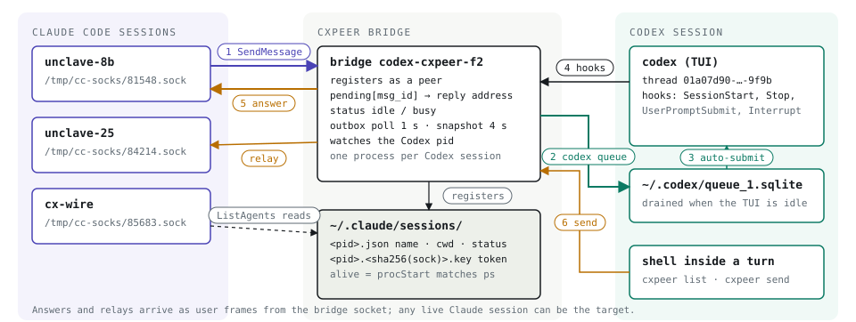
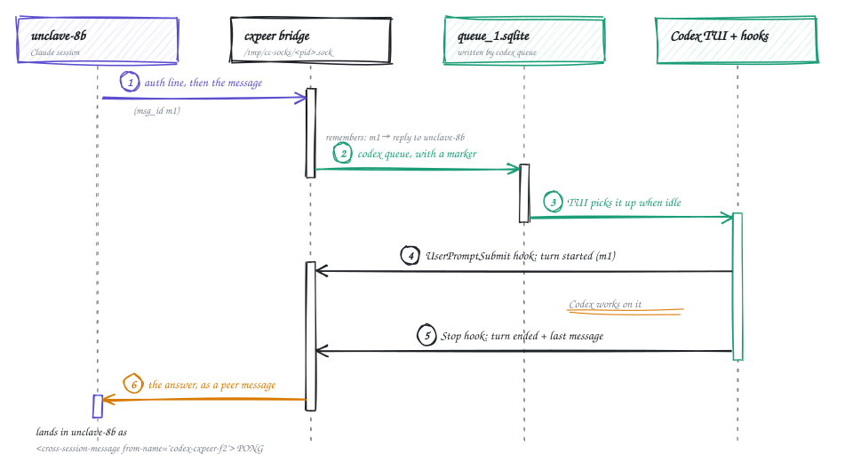
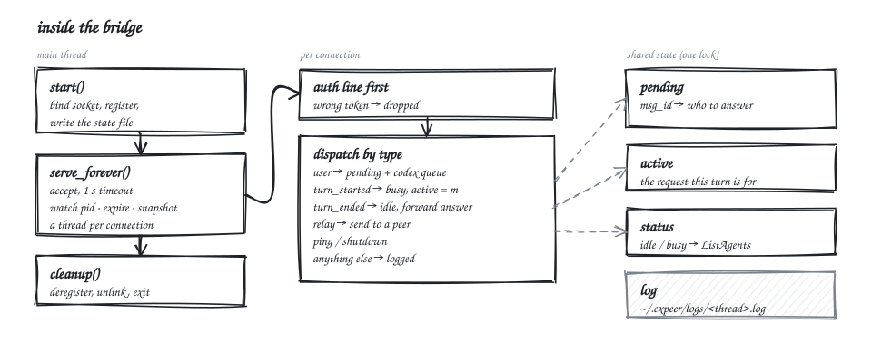
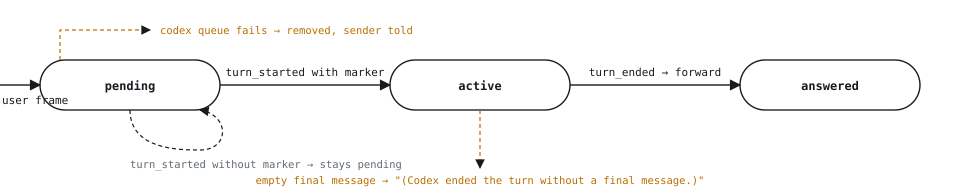

<h1 align="center">cxpeer</h1>

<p align="center">Codex CLI sessions as first-class peers in Claude Code's cross-session messaging.</p>

<p align="center">
  <a href="https://github.com/HivaMohammadzadeh1/cxpeer/actions/workflows/test.yml"></a>
  
  
  
  <a href="LICENSE"></a>
</p>

A running Codex session shows up in Claude Code's `ListAgents`, takes `SendMessage`
like any other session, and its answer comes back automatically when the turn ends.
Codex can message Claude sessions too. No daemon, no polling: three files, one Unix
socket, and Codex's own hooks.

<p align="center"></p>

## Contents

- [Quick start](#quick-start)
- [How it works](#how-it-works)
- [Commands](#commands)
- [Inside the bridge](#inside-the-bridge)
- [What the Codex sandbox changes](#what-the-codex-sandbox-changes)
- [Configuration](#configuration)
- [Development](#development)
- [Limits](#limits)

## Quick start

Requirements: macOS, Python 3.11+, Codex CLI 0.153+, Claude Code 2.1.263 or later.
`cxpeer spawn` also needs `tmux`.

```sh
uv tool install git+https://github.com/HivaMohammadzadeh1/cxpeer   # or: pipx install git+https://github.com/HivaMohammadzadeh1/cxpeer
cxpeer install
```

From a checkout, use `uv tool install --editable .` or `pipx install -e .` instead.

`cxpeer install` merges five hook entries into `~/.codex/hooks.json` (`SessionStart`,
`UserPromptSubmit`, `Stop`, `Interrupt`, `SessionEnd`) and writes the Codex skill to
`~/.codex/skills/cxpeer/SKILL.md`, which tells Codex when to run `cxpeer list` and
`cxpeer send`. It never duplicates its own entries and never touches hooks it did not
write. Run `cxpeer install --dry-run` first to see the exact files it would write, and
run `cxpeer install` again after upgrading cxpeer.

The next time Codex starts it asks once to trust the new hooks. Choose **Trust all and
continue**; without that the hooks do not run and no bridge is created.

Then, from any Claude Code session:

1. Start Codex (or `cxpeer spawn codex --cwd DIR --prompt "task"`) and submit a first
   prompt. Codex creates the session lazily, so the bridge appears at that moment.
2. Run `ListAgents`. The Codex session is listed as `codex-<dir>-<xx>`.
3. `SendMessage` it. The final answer of that Codex turn arrives back as a
   cross-session message from the same name.

### Claude Code side (optional)

A Claude session needs nothing extra to see Codex peers. A small skill that explains
how to start and message them ships as a Claude Code plugin:

```sh
claude plugin marketplace add HivaMohammadzadeh1/cxpeer
claude plugin install cxpeer@cxpeer
```

Inside a running Claude session the same two are `/plugin marketplace add
HivaMohammadzadeh1/cxpeer` and `/plugin install cxpeer@cxpeer`.

## How it works

There is one **bridge** process per Codex session. It is the Codex session's identity
inside Claude's peer system: it writes the registry record, key file, and Unix socket
that Claude Code expects under `~/.claude/sessions` and `/tmp/cc-socks`, so from
Claude's side it is just another peer.

<p align="center"></p>

1. The `SessionStart` hook spawns a bridge for the session and watches the Codex pid.
2. A Claude session sends a message. It lands on the bridge's socket, and the bridge
   runs `codex queue`, which auto-submits the text into the idle Codex TUI in about
   three seconds.
3. The queued text carries a `[cxpeer msg_id=...]` marker. When Codex submits that
   turn, the `UserPromptSubmit` hook reports the marker to the bridge; when the turn
   ends, the `Stop` hook hands the bridge Codex's final message, which the bridge
   forwards to the session that asked. A prompt typed by the human carries no marker,
   so a human turn is never forwarded to a peer. An interrupted turn tells the sender
   that instead, and a request that never pairs with a turn expires after 15 minutes
   with a note to the sender.
4. From the Codex side, `cxpeer send --to NAME "text"` asks the bridge to relay a
   message to any peer, and `cxpeer list` shows the names.
5. When the Codex session ends, the `SessionEnd` hook tells the bridge to deregister.
   If Codex exits without firing the hook, the bridge notices its watched pid is gone
   and cleans up within a few seconds.

Measured on 2026-09-07 with a real Codex TUI: a `SendMessage` was answered in 8 seconds
end to end, most of it Codex thinking; a `cxpeer send` run inside Codex arrived in the
Claude session 10 seconds after the request went in.

## Commands

| Command | What it does |
| --- | --- |
| `cxpeer list` | One row per live peer: `name [ref]  status  cwd`. |
| `cxpeer send --to NAME TEXT` | Message a peer by name or ref. `TEXT` may be `-` to read stdin. Routes through this session's bridge so the reply can come back; with no bridge it delivers directly and warns that replies cannot be routed. |
| `cxpeer status` | Every bridge, whether it answers, and how many requests are waiting for a turn. |
| `cxpeer install [--dry-run]` | Install or update the Codex hooks and skill. |
| `cxpeer spawn codex\|claude [--cwd DIR] [--name NAME] [--prompt TEXT] [-- ARGS...]` | Start a new Codex or Claude session in a detached tmux session. Anything after `--` goes to the child command verbatim. |
| `cxpeer bridge --thread ID --cwd DIR [--name NAME] [--watch-pid PID]` | Run a bridge. Started by the `SessionStart` hook; not normally run by hand. |
| `cxpeer hook EVENT` | Handle one Codex hook event with the payload as JSON on stdin. Never fails a turn: on any error it logs and exits 0. |

## Inside the bridge

About 400 lines of standard library in `cxpeer/bridge.py`. The main thread binds the
socket, registers, and runs the accept loop; each connection gets a thread that checks
the auth line and dispatches frames; handlers share one small state table under a lock.

<p align="center"></p>

The bridge never inspects Codex's transcript. It pairs an answer with the request that
caused it through the marker it appended to the queued text:

<p align="center"></p>

The on-disk contract, verified against Claude Code 2.1.263:

```text
~/.claude/sessions/<pid>.json                       registry record (name, cwd, status, socket path, procStart)
~/.claude/sessions/<pid>.<sha256(socket path)>.key  {"peerToken": <32 hex>, "procStart": ..., "pidDomain": "darwin"}, mode 0600
/tmp/cc-socks/<pid>.sock                            Unix stream socket, mode 0600
```

Two JSON lines per message; the receiver's token goes first and the sender's socket is
the reply address:

```json
{"type":"auth","token":"<receiver's peerToken>"}
{"msgV":1,"msg_id":"<uuid4>","type":"user","priority":"next","from":"uds:/tmp/cc-socks/<sender pid>.sock",
 "message":{"role":"user","content":"<cross-session-message from=\"uds:...\" from-name=\"codex-cxpeer-f2\" from-mode=\"prompting\">\nPONG\n</cross-session-message>"}}
```

## What the Codex sandbox changes

Codex runs shell commands in a sandbox where `ps` cannot execute and Unix sockets
cannot be opened, while reads of the home directory work and writes to `/tmp`,
`$TMPDIR`, and the working directory are allowed. So inside Codex, `cxpeer send` and
`cxpeer list` never touch the bridge socket:

| From inside Codex's shell | Result | Consequence |
| --- | --- | --- |
| `ps -o lstart= -p PID` | operation not permitted | registry liveness unusable |
| `connect(/tmp/cc-socks/*.sock)` | `PermissionError` | no relay, no direct send |
| read `~/.claude/sessions`, `~/.cxpeer` | allowed | state files are discoverable |
| write `/tmp`, `$TMPDIR`, cwd | allowed | a file outbox works |

`send` drops `{id, to, text}` into `/tmp/cxpeer-<uid>/<thread>/`; the bridge polls that
directory every second, relays, and writes `<id>.result.json` for the caller. `list`
reads a peers snapshot the bridge refreshes every four seconds (a snapshot older than
15 seconds counts as no bridge). Detection is by behaviour, not configuration: a socket
`PermissionError` or an unusable `ps` selects the file path. Outside the sandbox the
same commands use the socket directly. A bridge started by an older cxpeer has no
outbox; a sandboxed `send` then says so, and restarting the Codex session fixes it.

## Configuration

Every filesystem location has an override, so tests and alternate setups never touch
real state.

| Variable | Default | Used for |
| --- | --- | --- |
| `CXPEER_CLAUDE_SESSIONS_DIR` | `~/.claude/sessions` | Claude's peer registry |
| `CXPEER_SOCK_DIR` | `/tmp/cc-socks` | peer sockets |
| `CXPEER_HOME` | `~/.cxpeer` | bridge records, snapshots, logs |
| `CXPEER_OUTBOX_ROOT` | `/tmp/cxpeer-<uid>` | requests from sandboxed `cxpeer send` |
| `CXPEER_CODEX_BIN` | `codex` | the Codex executable |
| `CXPEER_CODEX_HOME` | `~/.codex` | where `install` writes |
| `CXPEER_TMUX_BIN` | `tmux` | used by `spawn` |
| `CXPEER_PENDING_TTL_SECONDS` | `900` | how long a request may wait for a turn |

Logs: `~/.cxpeer/logs/hooks.log` for the hooks and `~/.cxpeer/logs/<thread>.log` per
bridge. When a message does not arrive, read those first.

## Development

```sh
uv venv .venv --python 3.13 && uv pip install -e ".[dev]" --python .venv/bin/python
.venv/bin/python -m pytest tests -q
```

Tests are isolated by the fixtures in `tests/conftest.py` and never touch
`~/.claude/sessions`, `/tmp/cc-socks`, `~/.cxpeer`, or the real `codex`. The bridge is
tested as a subprocess with a fake `codex` that records its arguments and a fake Claude
peer socket that captures what it receives. CI runs the suite on `macos-latest`.

For a live check against a real Codex TUI, `scripts/e2e.sh [DIR]` starts one in a tmux
session, answers Codex's startup prompts, sends a first prompt so the bridge appears,
and prints the peer name to message from a Claude session. `scripts/e2e.sh down` tears
it down.

Design notes live in `docs/superpowers/specs/2026-09-07-cxpeer-design.md`.

## Limits

- cxpeer builds on an undocumented Claude Code internal (`peerProtocol` 1). A Claude
  Code update can break it without warning. The tests pin today's contract so a break
  is loud.
- macOS only. Liveness uses `ps -o lstart=` and the registry assumes a darwin pid
  domain. Windows is not supported.
- Peer messages are plain text between processes of the same user. Outbox files under
  `/tmp/cxpeer-<uid>` are created with the writer's umask; treat them as readable by
  anything running as you.
- Out of scope: file attachments, idle notifications, multi-machine or bridge-to-bridge
  relays, Codex `exec` (non-interactive) mode, message history, and any retry beyond a
  single delivery attempt.

## License

[PolyForm Noncommercial 1.0.0](LICENSE). Free to use, copy, modify, and share for
noncommercial purposes: personal projects, research, experiments, teaching, and use
by educational institutions, public research organizations, charities, and government
bodies. No warranty, no liability. Any commercial use, including building a product or
service on it, needs a separate license from the copyright holder; open an issue or
contact [Hiva Mohammadzadeh](https://github.com/HivaMohammadzadeh1).
